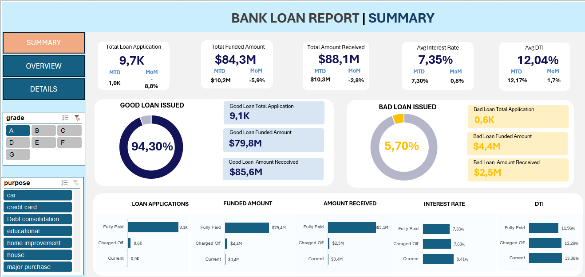
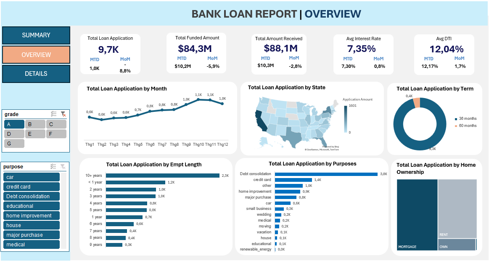
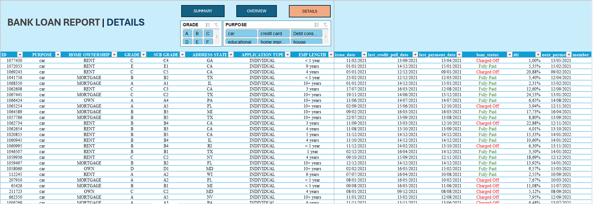

# 🏦 Bank Loan Performance & Risk Analytics

## 📌 Project Overview
This project showcases the end-to-end development of an interactive **Bank Loan Dashboard** using Microsoft Excel. The primary objective is to demonstrate proficiency in data manipulation, metric calculation, and data visualization. 

By transforming raw financial data into a dynamic reporting tool, this dashboard allows stakeholders to monitor loan portfolio performance, track key metrics (MTD, MoM), and identify high-risk segments such as bad loans.

---

## 🛠️ Key Excel Skills Demonstrated
This repository serves as a portfolio piece highlighting advanced Excel techniques tailored for Data Analytics:
*   **Data Modeling & Architecture:** Structuring data into calculation sheets (Pivot Tables) and a presentation layer.
*   **Dynamic Visualizations:** Utilizing Map Charts, Donut Charts, Bar/Line Graphs, and Treemaps to represent multidimensional data.
*   **Interactive UI/UX Design:** Implementing Slicers (Grade, Purpose) and hyperlinked navigation buttons for a seamless, app-like user experience.
*   **Advanced Formatting:** Applying Conditional Formatting (e.g., highlighting "Charged Off" loans in red) for quick risk identification.
*   **Metric Calculations:** Deriving business KPIs including Month-to-Date (MTD) and Month-over-Month (MoM) changes.

---

## 📊 Dashboard Architecture
The dashboard is divided into three interconnected views, each serving a specific analytical purpose:

### 1. Executive Summary View

Provides a high-level snapshot of the bank's loan portfolio health.
*   **Core KPIs:** Total Loan Applications (9.7K), Funded Amount ($84.3M), Amount Received ($88.1M), Average Interest Rate (7.35%), and Average DTI (12.04%).
*   **Risk Assessment:** A clear split between "Good Loans" (94.30%) and "Bad Loans" (5.70%), helping managers instantly gauge portfolio quality.
*   **Status Breakdown:** Grid analysis of loan metrics categorized by Fully Paid, Charged Off, and Current statuses.

### 2. Analytical Overview View

Focuses on trends, demographics, and categorical distribution to uncover underlying patterns.
*   **Temporal Trends:** Line chart tracking loan applications month by month.
*   **Geographical Distribution:** Map chart visualizing application volume across different US states.
*   **Categorical Deep Dives:** Breakdowns by Term (36 vs. 60 months), Employment Length, Loan Purpose, and Home Ownership.

### 3. Details View

Serves as the operational database for cross-referencing and auditing individual loan records.
*   Displays row-level data including ID, Purpose, Grade, Employment Length, and Dates.
*   Integrated top-level slicers for rapid filtering.
*   **Conditional Formatting** automatically flags high-risk accounts (Charged Off) for quick operational follow-up.

---

## 💡 Business Questions This Dashboard Answers
While designed to showcase technical Excel proficiency, the underlying data structure is built to answer critical business questions:
1.  **Risk Management:** Which loan purposes or demographic segments (e.g., Home Ownership status) contribute most to the "Bad Loan" percentage?
2.  **Growth Tracking:** How do the current month's loan applications and funded amounts compare to the previous month (MoM growth)?
3.  **Portfolio Strategy:** What is the predominant loan term (36 vs. 60 months), and how does it correlate with the average interest rate?
4.  **Operational Efficiency:** How quickly can the collections team filter and identify individual "Charged Off" loans in specific states?

---
